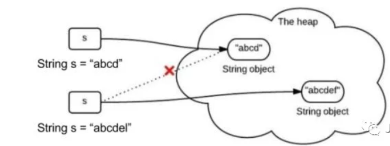
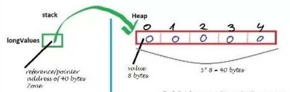

## 创建字符串

创建字符串最简单的方式如下:
String greeting = "菜鸟教程";
在代码中遇到字符串常量时，这里的值是 "**菜鸟教程**""，编译器会使用该值创建一个 String 对象。
和其它对象一样，可以使用关键字和构造方法来创建 String 对象。
String 类有 11 种构造方法，这些方法提供不同的参数来初始化字符串，比如提供一个字符数组参数:

```java
public class StringDemo {
    public static void main(String args[]) {
        char[] helloArray = {'r', 'u', 'n', 'o', 'o', 'b'};
        String helloString = new String(helloArray);
        System.out.println(helloString);
    }
}
```

以上实例编译运行结果如下：

```java
runoob
```

**注意:** String 类是不可改变的，所以你一旦创建了 String 对象，那它的值就无法改变了（详看笔记部分解析）。
如果需要对字符串做很多修改，那么应该选择使用 [StringBuffer & StringBuilder 类](https://www.runoob.com/java/java-stringbuffer.html)。

## 基本用法

### 字符串与byte数组间的相互转换

```java
import java.io.UnsupportedEncodingException;

public class StringDemo3 {
    //字符串和byte数组之间的相互转换
    public static void main(String[] args) throws UnsupportedEncodingException {
        //将字符串转换为byte数组，并打印输出
        String str = new String("hhhabc银鞍照白马 飒沓如流星");
        byte[] arrs = str.getBytes("GBK");
        for (int i = 0; i) {
            System.out.print(arrs[i]);
        }
        System.out.println();
        //将byte数组转换成字符串
        //保持字符集的一致，否则会出现乱码
        String str1 = new String(arrs, "GBK");
        System.out.println(str1);
    }
}
```


### ==运算符和equals之间的区别

**引用指向的地址和引用指向的内容**


```java
public class StringDemo5 {
    public static void main(String[] args) {
        String str1 = "mpp";
        String str2 = "mpp";
        String str3 = new String("mpp");
        System.out.println(str1.equals(str2)); //true  内容相同
        System.out.println(str1.equals(str3));   //true  内容相同
        System.out.println(str1 == str2);   //true   地址相同
        System.out.println(str1 == str3);   //false  地址不同
    }
}
```


### 字符串的不可变性

String的对象一旦被创建，则不能修改，是不可变的。**所谓的修改其实是创建了新的对象，所指向的内存空间不变。**


上图中，s1不再指向imooc所在的内存空间，而是指向了hello,imooc
### String的连接

表达式只有常量时，编译期完成计算。
表达式有变量时，运行期才计算，所以地址不一样。

```java
@Test
public void contact () {
    //连接方式
    String s1 = "a";
    String s2 = "a";
    String s3 = "a" + s2;
    String s4 = "a" + "a";
    String s5 = s1 + s2;
    //表达式只有常量时，编译期完成计算
    //表达式有变量时，运行期才计算，所以地址不一样
    System.out.println(s3 == s4);    // false
    System.out.println(s3 == s5);    // false
    System.out.println(s4 == "aa");  // true

}
```
### String、String builder和String buffer的区别
String是Java中基础且重要的类，并且String也是Immutable类的典型实现，被声明为final class，除了hash这个属性其它属性都声明为final，**因为它的不可变性，所以例如拼接字符串时候会产生很多无用的中间对象，如果频繁的进行这样的操作对性能有所影响。**

**StringBuffer就是为了解决大量拼接字符串时产生很多中间对象问题而提供的一个类**，提供append和add方法，可以将字符串添加到已有序列的末尾或指定位置，它的本质是一个线程安全的可修改的字符序列，把所有修改数据的方法都加上了synchronized。但是保证了线程安全是需要性能的代价的。

在很多情况下我们的字符串拼接操作不需要线程安全，这时候StringBuilder登场了，StringBuilder是JDK1.5发布的，它和StringBuffer本质上没什么区别，就是去掉了保证线程安全的那部分，减少了开销。

StringBuffer 和 StringBuilder 二者都继承了 AbstractStringBuilder ，**底层都是利用可修改的char数组(JDK 9 以后是 byte数组)。所以如果我们有大量的字符串拼接，如果能预知大小的话最好在new StringBuffer 或者StringBuilder 的时候设置好capacity，避免多次扩容的开销。扩容要抛弃原有数组，还要进行数组拷贝创建新的数组。**

我们平日开发通常情况下少量的字符串拼接其实没太必要担心，例如

String str = "aa"+"bb"+"cc";

**像这种没有变量的字符串，编译阶段就直接合成"aabbcc"了**，**然后看字符串常量池（下面会说到常量池）里有没有，有直接引用，没有就在常量池中生成，返回引用。**

如果是带变量的，其实影响也不大，JVM会帮我们优化了。

> 1、在字符串不经常发生变化的业务场景优先使用String(代码更清晰简洁)。如常量的声明，少量的字符串操作(拼接，删除等)。
>
> 2、在单线程情况下，如有大量的字符串操作情况，应该使用StringBuilder来操作字符串。不能使用String"+"来拼接而是使用，避免产生大量无用的中间对象，耗费空间且执行效率低下（新建对象、回收对象花费大量时间）。如JSON的封装等。
>
> 3、在多线程情况下，如有大量的字符串操作情况，应该使用StringBuffer。如HTTP参数解析和封装等。

## 源码分析

### String类型的intern

调用intern时,如果字符不在常量池，则加入常量池并返回常量的引用。

```java
//string的intern使用
public void intern () {
    //s1是基本类型，比较值。
    //s2是string实例，比较实例地址
    //字符串类型用equals方法比较时只会比较值
    String s1 = "a";
    String s2 = new String("a");
    //调用intern时,如果s2中的字符不在常量池，则加入常量池并返回常量的引用
    String s3 = s2.intern();
    System.out.println(s1 == s2);//false
    System.out.println(s1 == s3);//true
}
```

### String类型的equals

```java
//字符串的equals方法
public boolean equals(Object anObject) {
        if (this == anObject) {
            return true;
        }
        if (anObject instanceof String) {
            String anotherString = (String)anObject;
            int n = value.length;
            if (n == anotherString.value.length) {
                char v1[] = value;
                char v2[] = anotherString.value;
                int i = 0;
                while (n-- != 0) {
                    if (v1[i] != v2[i])
                        return false;
                    i++;
                }
                return true;
            }
        }
        return false;
}
```

### StringBuffer和Stringbuilder
底层是继承父类的可变字符数组value

```java
/**
 * The value is used for character storage.
 */
char[]value; //初始化容量为16

/**
 * Constructs a string builder with no characters in it and an
 * initial capacity of 16 characters.
 */
public StringBuilder(){
        super(16);
}

//这两个类的append方法都是来自父类AbstractStringBuilder的方法
public AbstractStringBuilder append(String str){
        if(str==null)
        return appendNull();
        int len=str.length();
        ensureCapacityInternal(count+len);
        str.getChars(0,len,value,count);
        count+=len;
        return this;
}

@Override
public StringBuilder append(String str){
        super.append(str);
        return this;
}

@Override
public synchronized StringBuffer append(String str){
        toStringCache=null;
        super.append(str);
        return this;
}
```

### append方法
StringBuffer在大部分涉及字符串修改的操作上加了synchronized关键字来保证线程安全，效率较低。
String类型在使用 + 运算符例如**String a = "a"； a = a + a;**时，实际上先把a封装成stringbuilder，调用append方法后再用tostring返回，所以当大量使用字符串加法时，会大量地生成string实例，这是十分浪费的，这种时候应该用stringbuilder来代替string。

### 扩容
注意在append方法中调用到了一个函数

ensureCapacityInternal(count + len);
该方法是计算append之后的空间是否足够，不足的话需要进行扩容

```java
public void ensureCapacity(int minimumCapacity) {
    if (minimumCapacity > 0)
        ensureCapacityInternal(minimumCapacity);
}
private void ensureCapacityInternal(int minimumCapacity) {
    // overflow-conscious code
    if (minimumCapacity - value.length > 0) {
        value = Arrays.copyOf(value,
                newCapacity(minimumCapacity));
    }
}
```

如果新字符串长度大于value数组长度则进行扩容
**扩容后的长度一般为原来的两倍 + 2；**
假如扩容后的长度超过了jvm支持的最大数组长度MAX_ARRAY_SIZE。
考虑两种情况
如果新的字符串长度超过int最大值，则抛出异常，否则直接使用数组最大长度作为新数组的长度。

```java
private int hugeCapacity(int minCapacity) {
    if (Integer.MAX_VALUE - minCapacity < 0) { // overflow
        throw new OutOfMemoryError();
    }
    return (minCapacity > MAX_ARRAY_SIZE)
        ? minCapacity : MAX_ARRAY_SIZE;
}
```

### 删除
都是调用父类的delete方法进行删除

```java
public AbstractStringBuilder delete(int start, int end) {
    if (start < 0)
        throw new StringIndexOutOfBoundsException(start);
    if (end > count)
        end = count;
    if (start > end)
        throw new StringIndexOutOfBoundsException();
    int len = end - start;
    if (len > 0) {
        System.arraycopy(value, start+len, value, start, count-end);
        count -= len;
    }
    return this;
}
```

事实上是将剩余的字符重新拷贝到字符数组value。
这里用到了system.arraycopy来拷贝数组，速度是比较快的


### system.arraycopy方法
转自知乎：

> 在主流高性能的JVM上（HotSpot VM系、IBM J9 VM系、JRockit系等等），可以认为System.arraycopy()在拷贝数组时是可靠高效的——如果发现不够高效的情况，请报告performance bug，肯定很快就会得到改进。
>
> java.lang.System.arraycopy()方法在Java代码里声明为一个native方法。所以最naïve的实现方式就是通过JNI调用JVM里的native代码来实现。
>
> String的不可变性
> 关于String的不可变性，这里转一个不错的回答
>
> 什么是不可变？
> String不可变很简单，如下图，给一个已有字符串"abcd"第二次赋值成"abcedl"，不是在原内存地址上修改数据，而是重新指向一个新对象，新地址。
>

## String和JVM的关系


下面我们了解下Java栈、Java堆、方法区和常量池：

Java栈（线程私有数据区）：

>  每个Java虚拟机线程都有自己的Java虚拟机栈，Java虚拟机栈用来存放栈帧，每个方法被执行的时候都会同时创建一个栈帧（Stack Frame）用于存储局部变量表、操作栈、动态链接、对象引用、方法出口等信息。每一个方法被调用直至执行完成的过程，就对应着一个栈帧在虚拟机栈中从入栈到出栈的过程。
>


Java堆（线程共享数据区）：

> 在虚拟机启动时创建，此内存区域的唯一目的就是存放对象实例，几乎所有的对象实例都在这里分配。


方法区（线程共享数据区）：

> 方法区在虚拟机启动的时候被创建，它存储了每一个类的结构信息，例如运行时常量池、字段和方法数据、构造函数和普通方法的字节码内容、还包括在类、实例、接口初始化时用到的特殊方法。在JDK8之前永久代是方法区的一种实现，而JDK8元空间替代了永久代，永久代被移除，也可以理解为元空间是方法区的一种实现。

 

常量池（线程共享数据区）：

> 常量池常被分为两大类：静态常量池和运行时常量池。
>
> 静态常量池也就是Class文件中的常量池，存在于Class文件中。
>
> 运行时常量池（Runtime Constant Pool）是方法区的一部分，存放一些运行时常量数据。


字符串常量池：

> 字符串常量池存在运行时常量池之中（**在JDK7之前存在运行时常量池之中，在JDK7已经将其转移到堆中**）。
> 字符串常量池的存在使JVM提高了性能和减少了内存开销。
>
> 使用字符串常量池，每当我们**使用字面量（String s=”1”;）创建字符串常量时**，JVM会首先检查字符串常量池，如果该字符串已经存在常量池中，那么就将此字符串对象的地址赋值给引用s（引用s在Java栈中）。如果字符串不存在常量池中，就会实例化该字符串并且将其放到常量池中，并将此字符串对象的地址赋值给引用s（引用s在Java栈中）。
>
> 使用字符串常量池，每当我们**使用关键字new（String s=new String(”1”);）创建字符串常量时**，JVM会首先检查字符串常量池，**如果该字符串已经存在常量池中，那么不再在字符串常量池创建该字符串对象，而直接堆中复制该对象的副本，然后将堆中对象的地址赋值给引用s，如果字符串不存在常量池中，就会实例化该字符串并且将其放到常量池中，然后在堆中复制该对象的副本，然后将堆中对象的地址赋值给引用s。（<u>多个一步在堆中复制副本的操作</u>）**

## 什么是不可变？

String不可变很简单，如下图，给一个已有字符串"abcd"第二次赋值成"abcedl"，不是在原内存地址上修改数据，而是重新指向一个新对象，新地址。



## String为什么不可变？

翻开JDK源码，java.lang.String类起手前三行，是这样写的：

```java
public final class String implements java.io.Serializable, Comparable<String>, CharSequence {   
/** String本质是个char数组. 而且用final关键字修饰.*/     
private final char value[];  ...  ...
} 
```

首先String类是用final关键字修饰，这说明String不可继承。
再看下面，String类的主力成员字段value是个char[]数组，而且是用final修饰的。

final修饰的字段创建以后就不可改变。 有的人以为故事就这样完了，其实没有。因为虽然value是不可变，也只是value这个引用地址不可变。挡不住Array数组是可变的事实。

Array的数据结构看下图。



也就是说Array变量只是stack上的一个引用，数组的本体结构在heap堆。

String类里的value用final修饰，只是说stack里的这个叫value的引用地址不可变。没有说堆里array本身数据不可变。看下面这个例子，

```java
final int[] value={1,2,3} ；
int[] another={4,5,6} ；
//编译器报错，final不可变 value用final修饰，编译器不允许我把value指向堆区另一个地址。
value=another;   
//但如果我直接对数组元素动手，分分钟搞定。
final int[] value={1,2,3} ；
//这时候数组里已经是{1,2,100}, 所以String是不可变
value[2]=100 ；
```

### 不可变有什么好处？
这个最简单地原因，就是为了安全。看下面这个场景，一个函数appendStr( )在不可变的String参数后面加上一段“bbb”后返回。appendSb( )负责在可变的StringBuilder后面加“bbb”。

总结以下String的不可变性。

> 1 首先final修饰的类只保证不能被继承，并且该类的对象在堆内存中的地址不会被改变。
>
> 2 但是持有String对象的引用本身是可以改变的，比如他可以指向其他的对象。
>
> 3 final修饰的char数组保证了char数组的引用不可变。但是可以通过char[0] = 'a’来修改值。不过String内部并不提供方法来完成这一操作，所以String的不可变也是基于代码封装和访问控制的。

举个例子

```java
final class Fi {
    int a;
    final int b = 0;
    Integer s;

}
final char[]a = {'a'};
final int[]b = {1};
@Test
public void final修饰类() {
    //引用没有被final修饰，所以是可变的。
    //final只修饰了Fi类型，即Fi实例化的对象在堆中内存地址是不可变的。
    //虽然内存地址不可变，但是可以对内部的数据做改变。
    Fi f = new Fi();
    f.a = 1;
    System.out.println(f);
    f.a = 2;
    System.out.println(f);
    //改变实例中的值并不改变内存地址。
    Fi ff = f;
    //让引用指向新的Fi对象，原来的f对象由新的引用ff持有。
    //引用的指向改变也不会改变原来对象的地址
    f = new Fi();
    System.out.println(f);
    System.out.println(ff);
}
```

这里的对f.a的修改可以理解为char[0] = 'a'这样的操作。只改变数据值，不改变内存值。

## String常用工具类
问题描述
很多时候我们需要对字符串进行很多固定的操作,而这些操作在JDK/JRE中又没有预置,于是我们想到了apache-commons组件,但是它也不能完全覆盖我们的业务需求,所以很多时候还是要自己写点代码的,下面就是基于apache-commons组件写的部分常用方法:

```xml
<dependency>
	<groupId>org.apache.commons</groupId>
	<artifactId>commons-lang3</artifactId>
	<version>${commons-lang3.version}</version>
</dependency>
```

## 参考文章
[https://blog.csdn.net/qq_34490018/article/details/82110578](https://blog.csdn.net/qq_34490018/article/details/82110578)
[https://www.runoob.com/java/java-string.html](https://www.runoob.com/java/java-string.html)
[https://www.cnblogs.com/zhangyinhua/p/7689974.html](https://www.cnblogs.com/zhangyinhua/p/7689974.html)
[https://blog.csdn.net/sinat_21925975/article/details/86493248](https://blog.csdn.net/sinat_21925975/article/details/86493248)
[https://www.cnblogs.com/niew/p/9597379.html](https://www.cnblogs.com/niew/p/9597379.html)