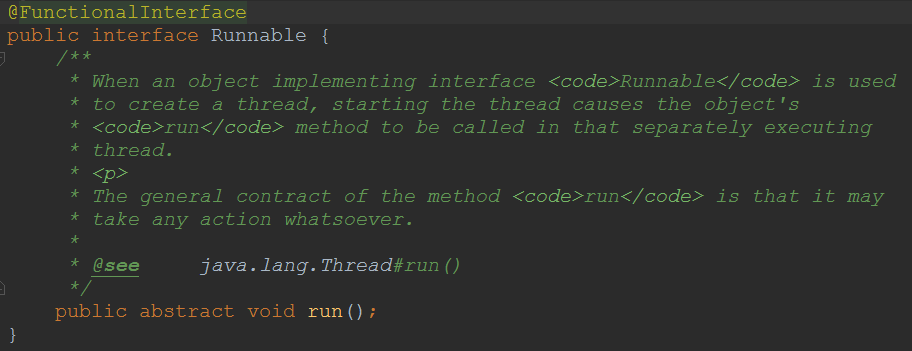

并发具有可论证的确定性，但是实际上具有不可确定性。

通过仔细设计和代码是审查，编写能够正确工作的并发程序是可能的。

## 1.1 并发的多面性

并发编程令人困惑的一个主要原因是：使用并发时需要解决的问题有多个，而实现并发的方式也有多种，并且在这两者之间没有明显的映射关系。因此，你必须理解所有这些问题和特例，以便高效地使用并发。

并发解决地问题大体上可以分为'速度'和'设计可管理性'两种。

### 1.1.1 更快的执行

如果你想要一个程序运行地更快，那么可以将其断开为多个片段，在单独的处理器上运行每个片段。并发是用于多处理器的基本工具。当前，摩尔定律已经有些过时了，速度提高是以多核处理器的形式而不是更快的芯片的形式出现的。为了使程序运行的更快，你必须学习如何使用这些额外的处理器，而这正是并发赋予你的能力。

并发通常是提高运行在单处理器上的程序的性能。

上下文切换的代价

如果程序中的某个任务因为该程序控制范围之外的某些条件（通常是I/O）而导致不能继续执行。那么我们就说这个任务或线程阻塞了。如果没有并发，则整个程序都将停止下来，知道外部条件发生变化。但是，如果使用并发来编写程序，那么当一个任务阻塞时，程序中的其他任务还可以继续执行，因此这个程序可以保持继续向前执行。事实上，从性能的角度看，如果没有任务会阻塞，那么在单处理器机器上使用并发就没有任何意义。

进程是运行在它自己地址空间内的自包容的程序。操作系统通常会将进程互相隔离开，因此它们不会彼此干涉。

多任务操作系统可以通过周期性地将CPU从一个进程切换到另一个进程，来实现同时运行多个程序。编写多线程程序最基本地困难在于协调不同的线程驱动的任务之间对这些资源的使用，以使得这些资源不会同时被多个任务访问。

函数型语言：将并发任务彼此隔离。Erlang

Java采用更加传统的方式，在顺序语言的基础上提供对线程的支持。

### 1.1.2 改进代码设计在单CPU机器上使用多任务的程序在任意时刻仍旧只在执行一项工作。

并发提供了一个重要的组织结构上的好处：你的程序设计可以极大地简化。某些类型的问题，例如**仿真**，没有并发的支持是很难解决的。

从编程的角度看模拟每个元素都有其自己的处理器，并且都是独立运行的任务，这种方式要容易很多。

解决这个问题的典型方式是协作多线程。Java的线程机制是抢占式的，这表示调度机制会周期性中断线程，将上下文切换到另一个线程，从而为每一个线程都提供时间片，使得每个线程都会分配到数量合理的时间去驱动它的任务。在协作系统中，每个任务都会自动的放弃控制，这要求程序员要有意识地在每个任务中插入某种类型的让步语句。协作系统的优势是双重的：上下文切换的开销比抢占式少很多，并且对可以同时执行的线程数量没有任何限制。当你处理大量仿真元素时，这是一种理想的解决方案。但是注意：某些协作系统并未设计为可以在多个处理器之间的分布任务，这可能会非常受限。

**消息系统**

并发需要付出代价，包含复杂性代价。

## 1.2 基本的线程机制

一个线程就是在进程中的一个单一的顺序控制流。

### 1.2.1 定义任务

线程驱动任务

Thread.yield()更有可能看到任务换进换出的证据。线程调度器，它在声明：我已经执行完生命周期中最重要的部分，此刻正是切换给其他任务执行一段时间的大好时机。

当从Runnable导出一个类时，它必需具有run()方法，但是这个方法并无特殊之处----它不会产生任何内在的线程能力。要实现线程行为，你必需**显式地将一个任务附着在线程上。**

### 1.2.2 Thread类p

将Runnable对象转变为工作任务的传统方式是把它提交给一个Thread构造器。

调用Thread对象的start()方法为该线程执行必需的初始化操作（线程状态为Runnable），然后调用Runnable的run()方法（线程状态为Running），以便在这个新线程中启动该任务。

线程驱动任务。

一次运行的结果可能和另一次运行的结果不同，线程调度器是非确定性的。

时间切片

//todo

在使用普通对象时，这对于垃圾回收来说是一场公平的游戏，但是在使用Thread时，情况就不同了。每个Thread都注册了它自己，因此，确实有一个对它的引用，而且在它的任务退出其run()并死亡之前，垃圾回收器无法清除它。一个线程会创建一个单独的执行线程，在对start()的调用完成之后，它仍旧会继续存在。

### 1.2.3 使用Executor

Java SE5 执行器将为你管理Thread对象，从而简化了并发编程。它在客户端和任务执行之间提供了一个间接层，与客户端直接执行任务不同，这个中介对象将执行任务。允许你管异步任务的执行，从而无需显式地管理线程地生命周期。启动任务地优选方法。

//todo

**命令设计模式**，暴露要执行的单一方法。

ExecutorService是具有服务生命周期的Executor，它知道如何构建恰当的上下文来执行Runnable对象。

单个的Executor被用来创建和管理系统所有的任务。

shutdown()方法的调用可以防止新任务被提交给Executor。

在任何线程池中，现有线程在可能的情况下，都会自动复用。

- CachedThreadPool 创建与所需数量相同的线程，然后在它回收旧线程时停止创建新线程，首选。
- FixedThreadPool 一次性预先执行代价高昂的线程分配，限制线程的数量。节省时间，不用为每个任务都固定付出创建线程的开销
- SingleThreadPool 提交了多个任务，任务将排队，每个任务都会在下一个任务开始之前运行结束，所有的任务将使用相同的线程。SingleThreadPool会序列化所有提交给它的任务，并会维护它自己隐藏的悬挂任务队列。

假设你有大量的线程，运行的任务将使用文件系统。你可以用SingleThreadPool 来运行这些线程，以确保任意时刻在任何线程中都只有唯一的任务在运行。在这种方式中，你不需要在共享资源上处理同步，同时不会过度使用文件系统。有时更好的解决方案是在资源上同步，但是SingleThreadPool 可以让你省去只是为了维持某些事物的原型而进行的各种协调努力。

### 1.2.4 从任务中返回值

//todo

完成时返回一个值--->实现Callable接口。泛型，类型参数是从call()返回的值，只能使用ExecutorService.submit()调用它。

### 1.2.5 休眠

任务终止执行给定的时间--->阻塞

InterrupedException，因为异常不能跨线程传播回main()，所以必需在本地run()处理所有的任务内部产生的异常。

### 1.2.6 优先级

可以在一个任务内部，通过调用Thread.currentThread()来获得对驱动该任务的Thread对象的引用。

优先级在run()的开头部分设定，在构造器中设置它们不会有任何好处，因为Executor在此刻还没开始执行任务。

变量为volatite的，以努力确保不进行任何编译器优化。

### 1.2.7 让步

如果知道已经完成了run()方法的循环的一次迭代过程中所需的工作，就可以给线程调度机制一个暗示：你的工作已经做的差不多了，可以让别的线程使用CPU了。--->yield()

这只是一个暗示，没有任何机制保证它将会被采纳。调用yield()时，你也是在建议具有相同优先级的其他线程可以运行。

对于任何重要的控制或在调整应用时，都不能依赖于yield()。实际上yield()经常被误用。

### 1.2.8 后台线程

所谓后台线程，是指在程序运行时候在后台提供一种通用服务的线程，并且这种线程并不属于不可或缺的部分。因此，当所有的非后台线程结束时，程序也就终止了，同时会杀死进程中的所有后台线程。

必须在线程启动之前设置为后台线程。

SimpleDaemon.java创建了显式的线程，以便可以设置它们的后台标志。通过编写定制的ThreadFactory，可以定制由Executor创建的线程的属性（后台，优先级，名称）。

每个静态的ExecutorService创建方法都被重载为接受一个ThreadFactory对象，而这个对象将被用来创建新的线程。

Daemon线程派生出来的子线程也是Daemon线程。

Daemon线程在不执行finally子句的情况下就会终止其run()方法。

当最后一个非后台线程终止时，后台线程会突然终止。因此，一旦main()退出，JVM就会立即关闭所有的后台进程，而不会有任何你希望出现的确认形式。因此，你不能以优雅的方式来关闭后台线程，所以他们几乎不是一种好的思想。非后台的Executor通常是一种更好的方式，因为Executor控制的所有任务可以同时关闭。

### 1.2.9 编码的变体

继承Thread

自管理的Runnable

构造器启动线程的问题--->Executor

有时候内部类将线程代码隐藏在类中将会很有用

### 1.2.10 术语

任务与线程：对Thread类实际没有任何控制权，并且这种隔离在使用执行器时更加明显，因为执行器将替你处理线程的创建和管理，你创建任务，并通过某种方式将一个任务附着在线程上，以使得线程可以驱动任务。Thread类自身不执行任何操作，它只是驱动赋予它的任务。

### 1.2.11 加入一个线程

一个线程可以在其他线程之上调用join()方法，其效果是等待一段时间直到第二个线程结束才继续执行。如果某个线程在另一个线程t上调用t.join()，此线程将被挂起，直到目标线程t结束才恢复。（即t.isAlive()返回为假）

也可以在调用join()时带上一个参数，这样如果目标线程在这段时间到期还没有结束的话，join()总能返回。

对join()方法的调用可以被中断，做法是在调用线程上调用interrupt()方法，这时需要用到try-catch子句。

sleep()方法有可能在指定的时间期满时返回，但也可能中断。

当另一个线程调用interrupt()，将给该线程设定一个标志，表明该线程已经中断。然而，异常被捕获时将清理这个标志，所以在catch子句中，在异常被捕获时这个标志总是假。

如果Sleeper被中断或是正常结束，Joiner将和Sleeper一同结束。

### 1.2.12 创建有响应的用户界面

### 1.2.13 线程组

最好把线程组看成是一次不成功的尝试，你只要忽略它就好了。

                                                                  ---Joshua Blosh

持有一个线程集合一次不成功的尝试

### 1.2.14 捕获异常

由于线程的本质，使得你不能捕获从线程中逃逸的异常。一旦异常逃出任务的run()方法，它就会向外传播到控制台（将main的主体放到try-catch语句块中也是没有作用的），除非你采用特殊的步骤来捕获这种错误的异常。

为了解决这个问题，我们要修改Executor产生线程的方式。Thread.UncaughtExceptionHandler是Java SE5中的新接口，它允许你在每个对象上附着一个异常处理器。

Thread.UncaughtExceptionHandler.uncaughtException()会在线程因未捕获的异常而临近死亡的时候被调用。

处处使用相同的异常处理器，Thread设置静态域，设置默认的未捕获异常处理器。

## 1.3 共享受限资源

### 1.3.1 不正确地访问资源

Boolean是原子性的，即诸如赋值和返回值这样的简单操作在发生时没有中断的可能，不会有中间状态。

Java中递增不是原子性的操作。如果不保护任务，单一的递增也不是安全的。

### 1.3.2 解决共享资源竞争

基本上所有的并发模式在解决线程冲突问题时候，都是采用序列化访问共享资源的方案。这意味着在给定的时刻只允许一个任务访问共享的资源。通常这是通过在代码前面加上一条锁语句来实现的。因为锁语句产生了一种互相排斥的效果，所以这种机制常常被称为互斥量。

当任务要执行被synchronized关键字保护的代码片段时候，它将检查锁是否可用，然后获取锁，执行代码，释放锁。

要控制对共享资源的访问，得先把它包装进一个对象。然后，把所有要访问这个资源的方法标记为synchronized。

所有的对象都自动含有单一的锁，也称为监视器。当在对象上调用其任意的synchronized方法的时候，此对象被加锁，这时，该对象的其他synchronized方法只有等到前一个方法调用完毕并释放了锁之后才能被调用。

单一的锁，所有的synchronized方法共享同一个锁。

将域设置为private非常重要，否则，synchronized不能防止其他任务直接访问域，这样就会产生冲突。

一个任务可以多次获得锁。

针对每个类，也有一个锁，作为类的Class对象的一部分，所以synchronized static方法可以在类的范围内防止对static数据的并发访问。

如果你正在写一个变量，它可能接下来将被另一个线程读取，或者正在读取一个上一次已经被另一个线程写过的变量，那么你必须使用同步，并且，读写线程都必须使用相同的监视器锁同步。

                                                                                                                                                                                                                         ---Brian同步规则

每个访问临界资源的方法都必需被同步，否则它们就不会正确地工作。

Thread.yield()被插入两个递增操作之间，提高是奇数状态的上下文切换的可能性。

Lock对象必需被显式地创建，锁定，释放。因此，它与内建的锁形式相比，代码缺乏优雅性。但是，对于解决某些类型的问题来说，它更加灵活。

紧接着对lock()的调用，你必须放置在finally子句中带有unlock()的try-finally语句中。注意，return语句必须在try子句中出现，以确保unlock()不会过早发生，从而将数据暴露给了第二个任务。

在使用synchronized关键字时，某些事物失败了，就会抛出一个异常。但是你没有机会做任何清理工作，以维护使其处于良好的状态。有了显式的Lock对象，你就可以使用finally子句将系统维护在正确的状态。

synchronized需要写的代码量更少，并且用户出现错误的可能性也会降低，因此通常只有在解决特殊问题时，才使用显式的Lock对象。

ReentrantLock允许你尝试获取但最终未获取锁，如果其他人已经获取了这个锁，那离开去执行其他的事情，而不是等待直至这个锁被释放。

Lock对象在加锁和释放锁方面，相对于内建的synchronized锁来说，还赋予了你更细粒度的控制力。

### 1.3.3 原子性和易变性

一个常不正确的知识是“原子操作不需要进行同步控制”。依赖原子性是很棘手且很危险的，如果你是一个并发专家，或者你得到了来自这样的专家的帮助，你才应该使用原子性来代替同步。

原子性可以应用于除long和double之外的所有基本类型之上的简单操作。

但是，当你定义long或double变量时，如果使用volatile关键字，就会获得原子性。

原子操作可由线程机制来保证其不可中断，**专家级的程序员**可以利用这一点来编写无锁的代码，这些代码不需要被同步。

同步机制强制在处理器系统中，一个任务的修改必需在应用中是可视的。

如果多个任务在同时访问某个域，那么这个域就应该是volatile的，否则，这个域只能经由同步来访问。同步也会导致向主存中刷新，如果一个域完全由synchronized方法或语句块来防护，那就不必将其设置为volatile的。

一个任务所做的任何操作对于这个任务来说都是可视的，因此如果它只需要在这个任务内部可视，那么你就不需要将其设置为volatile的。

当一个域的值依赖于它之前的值时（例如递增计数器），volatile就无法工作了。如果某个域的值受到其他域的值的限制，那么volatile也无法工作。

使用volatile而不是synchronized的唯一安全的情况是类中只有一个可变的域。再次提醒你，第一选择应该是使用synchronized关键字，这是最安全的方式，而尝试其他任何方式都是有风险的。

Java递增操作不是原子性的，并且涉及一个读操作，一个写操作。

基本上，一个域可能会被多个任务同时访问，或者这些任务中至少有一个是写入任务，那么你就应该将这个域设置为volatile的。如果你将一个域定义为volatile，那么他就会告诉编译器不要执行任何移除读取和写入操作的优化，这些操作的目的是用线程中的局部变量维护对这个域的精确同步。实际上，读取和写入都是直接针对内存的，而却没有被缓存。但是，volatile并不能对递增不是原子性操作这一事实产生影响。

### 1.3.4 原子类

AtomicInteger等

对于常规编程来说，它们很少会排上用场，但是在涉及性能调优时，它们就大有用武之地。

只有在特殊情况下才在自己的代码中使用他们，即便使用了也需要确保不存在其他可能出现的问题。通常依赖于锁更安全一些。

### 1.3.5 临界区

只是希望防止多线程同时访问方法内部的部分代码而不是防止访问整个方法。通过这种方式分离出来的代码段被称为临界区。也被称为同步控制块。时间性能得到显著提高。对象不加锁的时间更长，其他对象能更多的访问。

一些功能在基类中实现，并且其一个或多个抽象方法在派生类中定义，这种结构在设计模式中称为模板设计方法。

该设计模式使你得以把变化封装在代码里，在此，发生变化的部分是模板方法。

synchronized不是方法特征签名的组成部分，所以可以在覆盖方法的时候加上去。

同步代码块对象不加锁的时间更长，这也是宁愿使用同步代码块而不对整个方法进行同步控制的典型原因：使其他线程更多地访问。

还可以使用显式的Lock对象来创建临界区。

### 1.3.6 在其他对象上同步

synchronized块必须给定一个在其上进行同步的对象，并且最合理的方式是，使用其方法正在被调用的当前对象：synchronized(this)。在这种方式下，如果获得了synchronized块上的锁，那么该对象其他的synchronized方法和临界区就不能被调用。因此，如果在this上同步，临界区的效果就会直接缩小在同步的范围内。

有时必须在另一个对象上同步，但是如果你要这么做，就必须确保所有相关的任务都是在同一个对象上同步的。

两个任务可以同时进入同一个对象，只要这个对象上的方法是在不同的锁上同步的即可。

### 1.3.7 线程本地存储

防止任务在共享资源上产生冲突的第二种方式是根除对变量的共享。线程本地存储是一种自动化机制，可以为使用相同变量的每个不同的线程都创建不同的存储。他们使得你可以将状态和线程关联起来。

ThreadLocal对象通常当作静态域存储。你只能通过get()和set()方法来访问该对象的内容。

ThreadLocal保证不出现竞争条件。

## 1.4 终结任务

### 1.4.1 装饰性花园

参考实例代码

### 1.4.2 在阻塞时终结

如果某个域只会被读取和赋值，不会与其他域组合在一起被读取，不需要同步对其的访问，就可以安全的操作它，使用volatile即可。如果你对诸如此类的情况有任何疑虑，那么最好总是使用synchronized。

sleep使任务从执行状态变为阻塞状态。

## 线程状态

**new**：当线程被创建时，它只会短暂处于这个状态，此时它已经分配了必须的系统资源，并执行了初始化。此刻线程已经有资格获得CPU时间了，之后调度器将把这个线程转变为可运行状态或阻塞状态。

**Runnable**：在这种状态下，只要调度器将时间片分配给线程，线程就可以运行。也就是说，在任意时刻，线程可以运行也可以不运行，只要调度器分配时间片给线程，它就可以运行，这不同于死亡和阻塞。

**Blocked**：线程能够运行，但有个条件阻止它的运行。当线程处于阻塞状态时，调度器将忽略线程，不会分配给线程任何CPU时间。直到线程重新进入了就绪状态，它才有可能执行操作。

**Dead**：处于死亡或终止状态的线程将不再是可调度的，并且也不会得到CPU时间，它的任务已结束，或不再是可运行的。任务死亡的通常方式是从run()方法返回，但是任务的线程还可以被中断。

## 进入阻塞状态

- 通过调用sleep()使任务进入休眠状态，在这种情况下，任务在指定的时间内不会运行。
- 你可以通过wait()使线程挂起。直到线程得到了notify()或notifyAll()消息（或者signal()或signalAll()消息），线程才会进入就绪状态。
- 任务在等待某个输入/输出完成。
- 任务试图在某个对象上调用其同步控制方法，但是对象锁不可用，因为另一个任务已经获取了这个锁。

如果对于处于阻塞状态的任务，你不能等待其到达代码中可以检查其状态值的某一点，因而决定让他主动地终止，那么你就必须强制这个任务跳出阻塞状态。

### 1.4.3 中断

Thread类包含interrupt()方法，因此你可以终止被阻塞的任务，这个方法将设置线程的中断状态。如果一个线程已经被阻塞，或者试图执行一个阻塞的操作，那么设置这个线程的中断状态将抛出InterruptedException。当抛出该异常或者该任务调用Thread.interrupted()时，中断状态将复位。

Thread.interrupted()提供了离开run()循环而不抛出异常的第二种方式。

如果你在Executor上调用shutdownNow()，那么它将发送一个interrupt()调用给它启动的所有线程。

如果使用Executor，那么通过调用submit()而不是executor()来启动任务，就可以持有该任务的上下文。submit()将返回一个泛型Future<?>，其中有一个未修饰的参数，因为你永远都不会在其上调用get()---持有这种Future的关键在于你可以在其上调用cancel()，并因此可以使用它来中断某个特定任务。如果你将true传递给cancel()，那么它就会用拥有在该线程上调用interrupt()以停止这个线程的权限。因此，cancel()是一个中断由Excutor启动的单个线程的方式。

能够中断对sleep()的调用，或者任何要求抛出InterruptedException的调用。但是，你不能中断正在试图获取synchronized锁或者试图执行I/O操作的线程。--->关闭任务在其上发生阻塞的底层资源。

一旦底层资源被关闭，任务将解除阻塞。

NIO类提供了更人性化的I/O中断。被阻塞的nio通道会自动地响应中断。

**被互斥所阻塞**

互相调用，再次获得锁。一个任务应该能够调用在同一个对象中的其他的synchronized方法，而这个任务已经持有锁了。

无论在任何时刻，只要任务以不可中断的方式被阻塞，那么都有潜在的会锁住程序的可能。JavaSE5并发库中添加了一个特性，即在ReentrantLock上阻塞的任务具备可以被中断的能力。，这与在synchronized方法或者灵界区上阻塞的任务完全不同。

### 1.4.4 检查中断

当你在线程上调用interrupt()时，中断发生的唯一时刻是在任务要进入到阻塞操作中，或者已经在阻塞操作内部时。如果你只能通过在阻塞调用上抛出异常来退出，那么你就无法总是可以离开run()循环。因此，如果你调用interrupt()以停止某个任务，那么在run()循环碰巧没有产生任何阻塞调用的情况下，你的任务需要第二种方式来退出。

**中断状态**可以通过调用interrupt()来设置。你可以通过调用interrupted()来检查中断状态，这不仅可以告诉你

interrupt()是否被调用过，而且还可以清除中断状态。清除中断状态可以确保并发结构不会就某个任务被中断这个问题通知你两次，你可以经由单一的InterruptedException或单一的成功的Thread.interrupted()测试来得到这种通知。如果想要在此检查以了解是否被中断，则可以在调用Thread.interrupted()时将结果存储起来。

## 1.5 线程之间的协作

干涉----协调

线程同步----线程协作

当任务协作时，关键问题是这些任务之间的握手。为了实现这种握手，我们使用了相同的基础特性：互斥。

互斥能确保只有一个任务可以响应某个信号，这样就可以根除任何可能的竞争条件。在互斥之上，我们为任务添加了一种途径，可以将其自身挂起来，直到某些外部条件发生变化，表示是时候让这个任务向前开动了为止。

### 1.5.1 wait()与notifyAll()

sleep()和yield()时候锁并没有释放。

wait()时候锁释放。

wait()，notify()，notifyAll()方法是基类Object的一部分，而不是术语Thread的一部分。

调用wait()，notify()，notifyAll()的任务在调用这些方法前必须拥有获取对象的锁。

当你调用某个ExecutorService的shutdownNow()时，它会调用所有由它控制的线程的interrupt()。

检查所感兴趣的特定条件，并在条件不满足的情况下返回到wait()中。惯用的方法就是使用while来编写这种代码。

**错失的信号**

**//todo**

### 1.5.2 notify()与notifyAll()

调用notifyAll()比notify()要更安全。

使用notify()而不是notifyAll()是一种优化。

notifyAll()因某个特定锁而被调用时，只有等待这个锁的任务才会被唤醒。

### 1.5.3 生产者与消费者

//参考代码

**使用显式的Lock和Condition对象**

与使用notifyAll()相比，signalAll()是更安全的方式。

Lock和Condition对象只在更加困难的多线程问题中才是必须的。

### 1.5.4 生产者-消费者与队列

wait()和notifyAll()方法以一种非常低级的方式解决了任务互操作问题，即每次交互时都握手。在许多情况下，你可以瞄向更高的抽象级别，使用同步队列来解决任务协作问题，同步队列在任何时刻都只允许一个任务插入或移除元素。

java.util.concurrent.BlockingQueue.

- LinkedBlockingQueue，无界队列
- ArrayBlockingQueue 固定尺寸

如果消费者任务试图从队列中获取对象，而该队列此时为空，那么这些队列还可以挂起消费者任务，并且当有更多的元素可用时恢复消费者任务。阻塞队列可以解决非常大量的问题，而其方式与wait()和notifyAll()

相比，则简单并可靠得多。

**吐司BlockingQueue**

没有显式的同步，因为同步由队列（内部是同步的）和系统的设计隐式地管理了----任何时刻只有一个任务在操作。因为队列是阻塞的，使得处理过程被自动地挂起和恢复。在使用wait()和notifyAll()时存在的类与类之间的耦合被消除了，因为每个类都只和它的BlockingQueue通信。

### 1.5.5 任务间使用管道进行输入/输出

PipedWriter：允许任务向管道写。

PipedReader：允许不同任务从同一管道中读取。

这里的管道是一个封装好的解决方案，基本上是一个阻塞队列。

在shutdownNow()被调用时，可以看到PipedWriter与普通I/O之间最重要的差异---PipedWriter是可以中断的。

## 1.6 死锁

某个任务在等待另一个任务，而后者又等待别的任务，这样一直下去，直到这个链条上的任务又在等待第一个任务释放锁，这得到了一个任务之间互相等待的连续循环，没有哪个线程能继续，这被称之为**死锁。**

以下四个条件同时满足，就会发生死锁：

- 互斥条件，任务使用的资源中至少有一个是不能共享的。一根筷子一次只能被一个哲学家使用
- 至少有一个任务它必须持有一个资源且正在等待获取一个当前被别的任务持有的资源。哲学家必须拿着一根筷子并且等待另一根。
- 资源不能被任务抢占，任务必须把资源释放当作普通时间。哲学家很有礼貌，他们不会从其他哲学家那里抢筷子。
- 必须循环等待，一个任务等待其他任务所持有的资源，后者又在等待另一个任务所持有的资源，这样一直下去，直到有一个任务在等待第一个任务所持有的资源，使得大家都被锁住。

要防止死锁只需破坏其中一个条件即可。最容易的方法是破坏第四个条件，调整先右后左的顺序。

确保最后一个哲学家先拿起和放下左边的筷子，我们可以移除死锁，从而使这个程序平滑运行。

Java对死锁并没有提供语言层面的支持，只能通过设计程序来避免死锁。

## 1.7 新类库中的构件

### 1.7.1 CountDownLatch