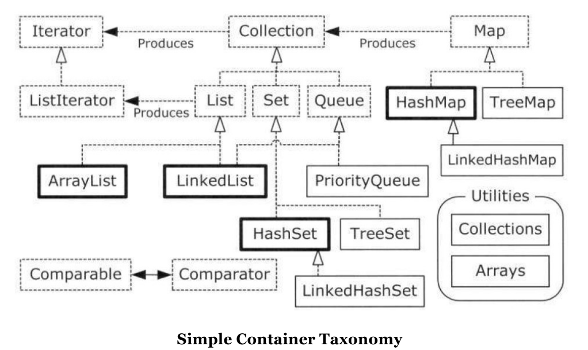

如果一个程序只包含固定数量的且其生命周期都是已知的对象，那么这是一个非常简单的程序。

数组是固定尺寸的。

Java容器类都可以自动调整自己的尺寸。

## 1 泛型和泛型安全的容器

使用Java SE5之前的容器的一个主要问题就是编译器允许你向容器中添加不正确的类型。

我们使用Java SE5所持有的注解来抑制了警告信息。@SuppressWarnings注解及其参数表示只有有关不受检查的异常的警告信息应该被抑制。

ArrayList保存的是Object，因此你不仅可以把Apple对象放进容器，还可以放Orange对象，无论是编译器还是运行时都不会报错。但是当你使用ArrayList的get()方法来取出你认为是Apple对象时，你得到的只是Object引用，必须将其转型为Apple。

通过使用泛型，可以在编译期防止将错误类型的对象放置到容器中。

在将元素从List中取出时，类型转换也不再是必须的了。因为List知道它保存的是什么类型，因此它会在调用get()时替你执行转型。这样，通过使用泛型，你不仅知道编译器将会检查你放置到容器中的对象类型，而且在使用容器中的对象时，可以使用更加清晰的语法。

程序输出的是Object默认的toString()方法产生的，该方法将打印类名，后面跟随该对象的散列码的无符号十六禁止表示（这个散列码是通过hashCode()方法产生的）。

## 2 基本概念

1. Collection。一个独立元素的序列，这些元素都服从一条或多条规则。List必须按照插入的顺序保存元素，而Set不能有重复元素。Queue按照排队规则来确定对象产生的顺序（通常与它们被插入的顺序相同）
2. Map。一组成对的键值对对象，允许你使用键来查找值（字典）。ArrayList允许你使用数字来查找值。

LinkedList具有在List接口中未包含的额外方法，而TreeMap也具有在Map接口中未包含的方法。如果你需要这些方法，就不能将它们转型为更通用的接口。

所有的Collection都可以用foreach语法遍历。

## 3 添加一组元素

Arrays.asList()方法接受一个数组或是一个用逗号分隔的元素列表（使用可变参数），并将其转为一个List对象。

Collection.addAll()方法接受一个Collection对象，以及一个数组或是一个用逗号分隔的列表，将元素添加到Collection中。

Collection.addAll()和 Collections.addAll()的区别： Collection.addAll()只能接受另一个 Collection对象作为参数，因此，它不如Arrays.asList()或 Collections.addAll()灵活，这两个方法使用的都是可变参数列表。

Arrays.asList()底层使用的是数组，因此不能调整尺寸。如果你试图用add()或delete()方法在这种列表中添加或删除元素就有可能会引发去改变数组尺寸的尝试，因此你将在运行时获得Unsupported Operation错误。

显式类型参数说明，Arrays.<Snow>asList.

## 4 容器的打印

HashSet最快的获取元素的方式，存储的顺序看起来并无实际意义。

TreeSet按照比较结果的升序保存对象。

LinkedHashSet按照被添加的顺序保存对象。

HashMap最快的查找技术，没有按照任何明显的顺序来保存其元素。

TreeMap按照比较结果的升序保存键。

LinkedHashMap按照插入的顺序保存键，同时还保留了HashMap的查询速度。

## 5 List

两种类型的List

- 基本的ArrayList，它长于随机访问元素，但是在List的中间插入和移除元素时较慢。
- LinkedList，通过代价较低的在List中间进行的插入和删除操作，提供了优化的顺序访问。LinkedList在随机访问方面较慢，但是它的特性集较ArrayList更大。

优化是一个很棘手的问题，最好的策略是置之不顾，直到你发现需要担心它了。

subList()所产生的列表的幕后就是初始列表，因此，对返回的列表的修改都会反映到初始列表中，反之亦然。

List的行为根据equals()的行为而有所变化。

## 6 迭代器

如何才能不重写代码就能应用于不同类型的容器？迭代器(也是一种设计模式)的概念可以用于达成此目的。迭代器是一个对象，它的工作是遍历并选择序列中的对象，而客户端程序员不必知道或关心该序列底层的结构。此外迭代器通常称为轻量级对象：创建它的代价小。因此，经常可以见到对迭代器有些奇怪的限制；例如，Java中的Iterator只能单向移动，这个Iterator只能用来：

- 使用方法iterator()要求容器返回一个Iterator。Iterator将准备好返回序列的第一个元素。
- 使用next()获得序列的下一个元素。
- 使用hasNext()检查序列中是否还有元素。
- 使用remove()将迭代器新近返回的元素删除。

Iterator还可以移除由next()产生的最后一个元素，这意味着在调用remove()之前必须先调用next().

Iterator的真正威力:能够将遍历序列的操作与序列底层的结构分离。正由于此，我们有时会说:迭代器统一了对容器的访问方式。

### 6.1 ListIterator

ListIterator是一个更强大的Iterator的子类型，它只能用于各种List类的访问。尽管Iterator只能向前移动，但是ListIterator可以双向移动。

## 7 LinkedList

- getFirst()和element()完全一样。返回列表第一个元素，如果List为空，则抛出NoSuchElementException。
- peek()在列表为空时候，返回null。其他都一样。

- removeFirst()和remove()完全一样。移除并返回列表第一个元素，如果List为空，则抛出NoSuchElementException。
- poll()在列表为空时候，返回null。其他都一样。

Queue在LinkedList的基础上添加了element()、offer()、peeek()、poll()、remove()方法，以使其可以成为一个Queue实现。

## 8 Stack

栈通常指后进先出（LIFO）的容器。有时也称为叠加栈，因为最后压入栈的元素，第一个弹出栈。

LinkedList具有能够直接实现栈的所有功能的方法，因此可以直接将LinkedList作为栈使用。

Stack是用LinkedList实现的。LinkedList可以产生更好的Stack。

## 9 Set

Set中最常使用的是测试归属性，你可以很容易的询问某个对象是否在某个Set中。正因为如此，查找就成了Set中最重要的操作，因此你通常都会选择一个**HashSet的实现，它专门对快速查找进行了优化。**

Set具有和Collection完全一样的接口，因此没有任何额外的功能。实际上Set就是Collection，只是行为不同。

- HashSet散列函数，速度快

- TreeSet将元素存储在红黑树数据结构中

- LinkedHashSet查询速度快且保持插入顺序

  TreeSet构造器传入排序方式：new TreeSet<String>(String.CASE_INSENSITIVE_ORDER)按字母排序

## 10 Map

containsKey()

containsValue()

keySet()

## 11 Queue

队列是一种先进先出(FIFO)的容器。队列常被用作一种可靠的将对象从程序的某个区域传输到另一个区域的途径。队列在并发编程中特别重要。它可以安全地将对象从一个任务传输到另一个任务。

LinkedList提供了方法以支持队列的行为，并且它实现了Queue接口，因此LinkedList可以用作Queue的一种实现。LinkedList可以向上转型为Queue。

Queue<Integer> queue = new LinkedList<Integer>();

Queue窄化了对LinkedList的方法的访问权限，以使得只有恰当的方法才可以使用，因此，因此你可以访问的LinkedList的方法会变少。

### 11.1 PriorityQueue

先进先出描述了最典型的队列规则。队列规则是指在给定一组队列中的元素情况下，确定下一个弹出队列规则。先进先出声明的是下一个元素应该是等待时间最长的元素。

优先级队列声明下一个弹出元素是最需要的元素。某些消息比其他消息更重要，因而应该更快得到处理，那么它们何时得到处理就与它们何时到达无关。PriorityQueue添加到Java SE5 是为了提供对这种行为的一种自动实现。

如果想在PriorityQueue中使用自己的类，就必须包括额外的功能以产生自然排序，或者必须提供自己的Comparator。

## 12 Collection和Iterator

Collection是描述所有序列容器的共性的根接口。AbstractCollection提供了Collection的默认实现，使得你可以创建AbstractCollection的子类型，而其中没有不必要的代码重复。

C++中容器的所有共性都是通过迭代器达成的。

实现Collection就意味着需要提供iterator()方法。

当你要实现一个不是Collection的外部类时，由于让他去实现Collection接口可能会非常困难或麻烦，因此使用Iterator就会变得非常吸引人。例如，我们通过继承一个持有Pet对象的类来创建一个Collection实现，那么我们必须实现所有的Collection方法，即使我们在display()中不必使用它们，也必须如此。尽管这个可以通过继承AbstractCollection而很容易实现，但是你无论如何还是要强制去实现iterator()和size()，以便提供AbstractCollection没有实现，但是AbstractCollection中其他方法会使用到的方法。

如果你实现Collection，就必须实现iterator()，并且只拿实现iterator()与继承AbstractCollection相比，花费的代价只有略微减少。但是，如果你的类已经继承了其他的类，那么你就不能再继承AbstractCollection了。在这种情况下，要实现Collection就必须实现该接口中的所有方法。此时，创建并提供创建迭代器的能力就会显得容易多了。

生成Iterator是将队列与消费队列的方法连接在一起耦合度最小的方式，并且与实现Collection相比，它在序列类上所施加的约束也少很多。

## 13 Foreach与迭代器

能够与foreach一起工作是所有Collection对象的特性。因为Java SE5引入了新的被称为Iterable的接口，该接口包含一个能够产生Iterator的iterator()方法，并且Iterator接口被foreach用来在序列中移动。因此如果你创建了任何实现Itarable的类，都可以将它用于foreach中。大量的类都是Iterable类型的，包括所有的Collection类，但是包括各种Map。

entrySet()产生一个由Map.Entry的元素构成的Set，并且这个Set是一个Iterable，因此它可以用于foreach循环。

foreach语句可以用于数组或其他任何Iterable，但是这并不意味着数组也是一个Iterable，而任何自动包装也不会自动发生。

### 13.1 适配器方法惯用法

当你有一个接口并需要另一个接口时，编写适配器就可以解决问题。

Arrays.asList()产生的List对象会使用底层数组作为其物理实现。只要你执行的操作会修改这个List，并且你不想原来的数组被修改，那么你就应该在另一个容器中创建一个副本。

## 14 总结

容器不能持有基本类型，但是自动包装机制会仔细地执行基本类型到容器中所持有地容器类型之间的双向转换。

Queue和各种栈的行为，都是LinkedList提供支持。

新程序中不应该使用过时的Vector、HashTable和Stack。

除了TreeSet之外的所有Set都拥有与Collection完全一样的接口。List和Collection存在着明显的不同，尽管List所要求的方法都在Collection中，另一方面，在Queue接口中的方法都是独立的；在创建具有Queue功能的实现时，不需要使用Collection方法。Map和Collection之间的唯一重叠就是Map可以使用entrySet()和values()方法来产生Collection。

